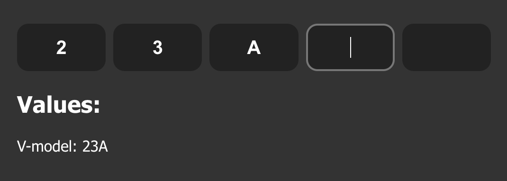

# Vue 3 code input

Code input for vue3 and nuxtjs 3. Code input for email or sms confirmations. Type or paste the code into multiple fields, get the string backwards.



## Installing
```js
import venCodeInput from "@venegrad/vue3-code-input"

export default {
  components: {
    venCodeInput
  },
}
```
Css if needed: 
```
@import '@venegrad/vue3-code-input/dist/venCodeInput.css'
```

## Props

- `length`: (Number), Default = 6, Number of fields
- `upper`: (Boolean), Default = false, Transform all characters to upper case
- `lower`: (Boolean), Default = true, Transform all characters to lower case
- `disallow`: (RegExp), Default = /[^a-zA-Z0-9]/g,, A regular expression that cuts characters
- `v-model`: v-model value (Array, ['John', 'Doe']), Dynamic v-model value
- `inFocus`: (Boolean), Default = true, Add onMounted autofocus to first input of code
- `error`: (String), Default = null, Add error class, and error text outer input
- `numbersOnly`: (Boolean), Default = true, Make input type Number with mobile parametres
- `blurdone : (Bollean), Default = false, Focus out and close mobile keyboard, when user write done code`

## Events
All you need to do is attach a watch event to the v-model value, but if that's not enough for you, I've added a few more events.

- `@changed` = return value of v-model when it changed. Starts first time on components mount, and every time when v-model changed.


## Simple example
```html
<venCodeInput
  v-model="vvalue"
  :upper="true"
  :lower="false"
  :length="5"
  :numbersOnly="true"
  :error="fieldError"
  :inFocus="true"
  :blurdone="false"
  :disallow="/[^a-zA-Z0-9]/g"
  @changed="changed"
/>
```

## Help links: 
- If my solution was helpful to you, please give me a star on [Github](https://github.com/Venegrad/vue3-code-input) or get my day better with: 
- USDT TRC20: `TKXybH3YoFvT5h8bQFLdkDBtiXA65y7xaB`
- USDT ERC20: `0xc3efeB4825E350eE5D6B032Aa1dE144B09B5bB0D`
